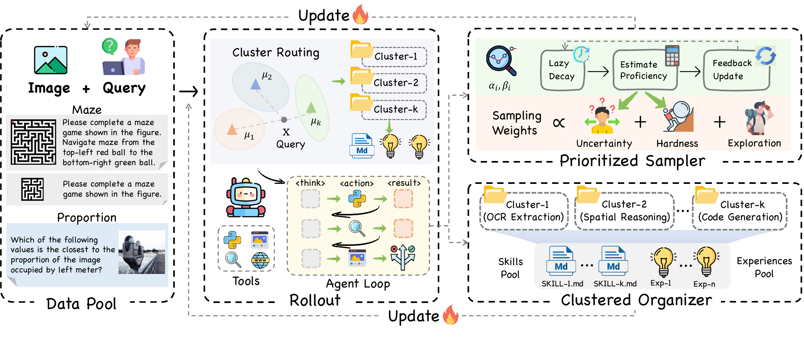

# ACE-Skill: Bootstrapping Multimodal Agents with Prioritized and Clustered Evolution



## Repository Layout

```text
.
├── eval/                          # Core training / inference pipeline
│   ├── train.py                   # Training-stage rollout + experience / skill update
│   ├── infer.py                   # Inference-stage rollout with retrieval
│   ├── cluster.py                 # K-Means clustering for prioritized organization
│   ├── ace_skill/                 # Experience manager, retriever, weighted sampler, skill builder
│   ├── engine/                    # API caller, tool handler, model dispatch
│   ├── tools/                     # Tool implementations (code interpreter, web / image search, ...)
│   ├── search/                    # SearchNode tree abstraction for reasoning state
│   ├── prompts/                   # Prompt templates (reasoning, experience, skill, judge)
│   ├── configs/                   # Tool configs (e.g. tool_configs.yaml)
│   └── utils/                     # Shared utilities
├── benchmark/                     # Train and test data
├── memory_bank/                   # Auto-generated experience / skill libraries per dataset
├── configs/                       # Top-level run configs (e.g. prioritize.yaml)
├── run_ace_skill.sh                 # End-to-end train / inference launcher
├── requirements.txt               # Python dependencies
└── README.md
```

## Environment

```bash
pip install -r requirements.txt
```

ACE-Skill needs three kinds of credentials: **LLM endpoints** (reasoning / verifier / experience generator + embedding model), **web-tool API keys** (only for benchmarks that browse the web), and an **image-host key** used by `image_search`.

### 1. `run_ace_skill.sh`

```bash
# --- Reasoning / verifier / experience LLMs ---------------------------------
# Primary endpoint (used for reasoning + experience generation)
REASONING_API_KEY=...
REASONING_END_POINT=...
# Secondary endpoint (used for the verifier and as a fallback)
REASONING_API_KEY_2=...
REASONING_END_POINT_2=...

# --- Embedding model for experience retrieval ------------------------------
EXPERIENCE_EMBEDDING_API_KEY=...
EXPERIENCE_EMBEDDING_ENDPOINT=...

# --- Web-tool credentials (only required for benchmarks that use them) -----
JINA_API_KEY=...     # used by `visit` for page parsing
SERPAPI_KEY=...      # used by `web_search`
```

### 2. `eval/configs/tool_configs.yaml`

Most fields in `eval/configs/tool_configs.yaml` are timeouts / limits with sensible defaults — the only entries you typically need to touch are:

```yaml
image_search:
  imgbb_api_key: "<your-imgbb-key>"         # required for image_search; get one at https://api.imgbb.com/

code_interpreter:
  work_dir: "workspace/code_interpreter"    # base dir for per-instance scratch dirs (auto-created)

zoom:
  work_dir: "workspace/zoom"                # base dir for per-instance scratch dirs (auto-created)
```

> Tip: only fill the credentials for tools listed in `ENABLED_TOOLS` for your dataset (see the `if`-branch in `run_ace_skill.sh`). For example, `tir-bench` only needs `code_interpreter` and works without any web or imgbb keys.

## Quick Start

### 1. Download Datasets

ACE-Skill is evaluated on four multimodal-agent benchmarks. Pick the ones you need and download them from Hugging Face:


| Benchmark       | Link                                                                                         |
| --------------- | -------------------------------------------------------------------------------------------- |
| VisualToolBench | [DjangoJungle/VisualToolBench](https://huggingface.co/datasets/DjangoJungle/VisualToolBench) |
| MMSearch-Plus   | [DjangoJungle/MMSearch-Plus](https://huggingface.co/datasets/DjangoJungle/MMSearch-Plus)     |
| TIR-Bench       | [DjangoJungle/TIR-Bench](https://huggingface.co/datasets/DjangoJungle/TIR-Bench)             |
| AgentVista      | [Warrieryes/AgentVista](https://huggingface.co/datasets/Warrieryes/AgentVista)               |


Place each dataset under `benchmark/<DatasetName>/` so that the train / test JSONs and image folders match the paths referenced by `run_ace_skill.sh`. For example, `TIR-Bench` should look like:

```text
benchmark/TIR-Bench/
├── data/                   # images referenced by samples
├── train.json
└── test.json
```

### 2. Cluster Preprocessing

Generate the `doc_id → cluster_id` mapping that the clustered organizer relies on. The script fits K-Means on the training set and predicts cluster ids for the test set, writing two JSON files next to the inputs:

```bash
python eval/cluster.py \
    benchmark/TIR-Bench/train.json \
    benchmark/TIR-Bench/test.json \
    -k 5
```

This produces `train_doc_id_to_cluster.json` and `test_doc_id_to_cluster.json` in the same directory; `run_ace_skill.sh` will look for these files automatically.

### 3. Train / Inference

`run_ace_skill.sh` wraps the full pipeline. Datasets are switched via `DATASET_NAME`; run identifiers control where logs, outputs and the memory bank are written.

```bash
# Self-evolving training
DATASET_NAME=tir-bench RUN_ID=my-run bash run_ace_skill.sh train

# Inference using the libraries built during training
DATASET_NAME=tir-bench RUN_ID=my-run INF_ID=my-run-infer bash run_ace_skill.sh inference

# Train then infer in one go
DATASET_NAME=tir-bench RUN_ID=my-run INF_ID=my-run-infer bash run_ace_skill.sh all
```

Outputs land in `output/<RUN_ID>/` and `output/<INF_ID>/`, logs in `logs/`, and the experience / skill libraries in `memory_bank/<RUN_ID>/`.

## Acknowledgments

ACE-Skill builds on and is inspired by prior work on self-evolving and memory-augmented agents. We thank the authors for open-sourcing their code.

- **[XSkill](https://github.com/XSkill-Agent/XSkill)** — a framework for continual learning from experiences and skills in multimodal agents. ACE-Skill's experience–skill accumulation pipeline, including the `eval/ace_skill/` modules, the tool-calling engine, and the overall launch-script structure, is built on the XSkill codebase.
- **[MemEvolve](https://github.com/bingreeky/MemEvolve)** — a meta-evolution framework that jointly evolves the memory content and the memory architecture itself.

## Citation

If you find Ace-Skill useful in your research, please cite:

```bibtex
@article{xiong2026aceskill,
  title={Ace-Skill: Bootstrapping Multimodal Agents with Prioritized and Clustered Evolution},
  author={Feng Xiong and Zengbin Wang and Yong Wang and Xuecai Hu and Jinghan He and Liang Lin and Yuan Liu and Xiangxiang Chu},
  year={2026},
  eprint={2605.08887},
  archivePrefix={arXiv},
  primaryClass={cs.AI},
  url={https://arxiv.org/abs/2605.08887},
}
```

